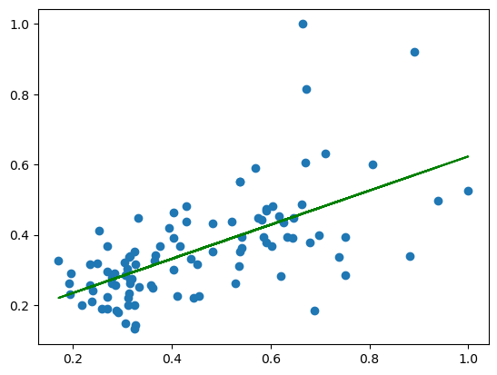
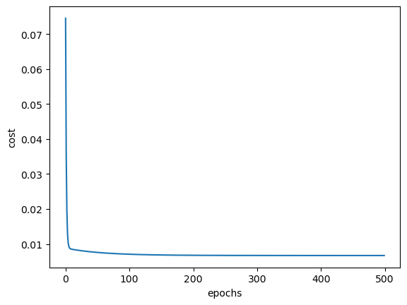

# Linear Regression Implementation

This repository contains implementations of Linear Regression algorithms in Python, demonstrating the core concepts of this fundamental machine learning technique with a focus on housing price prediction based on house area. The implementations are divided into two primary classes:

## Linear Regression Concepts

Simple Linear Regression is a basic yet powerful tool in machine learning for predicting outcomes. It works by finding a straight line that best fits the data points, making it easier to understand how changes in one variable affect another.

### Linear
The term "linear" means the model assumes a straight-line relationship between the feature (input) and the target (output). This simplicity makes it an excellent starting point for prediction tasks.

### Regression
In machine learning, "regression" refers to the process of predicting a number. Simple Linear Regression does this by adjusting a line to minimize the difference between the actual values and the predicted values.

### The Formula
The core of Simple Linear Regression is captured by the equation: \( y = wx + B \)
- \(y\) is the predicted outcome.
- \(x\) is your input.
- \(w\) (weight) shows how much a change in \(x\) affects \(y\).
- \(B\) (bias) adjusts the line to fit the data better.

### Weight and Bias
- **Weight (w):** Tells us how the input and output are connected. If \(w\) is high, even a small change in \(x\) can greatly affect \(y\).
- **Bias (B):** Helps to start the line from the most fitting point, ensuring the prediction is as accurate as possible right from the start.

 It's all about drawing a line through data to predict future points.

## 1. `SimpleLinearRegression`
This class implements Linear Regression using a `single feature` (House area in square feet). It is designed to illustrate the basic principles of Linear Regression, including fitting a model, making predictions, and understanding the underlying mathematics. Key features:

- **No dependencies on external libraries**: Pure Python implementation.
- **Fit Method**: `fit(x, y, lr)` where `x` is the house area, `y` is the house price, and `lr` is the learning rate.
- **Predict Method**: `predict(x)` used for making predictions on new house areas.
- **Cost Function**: Evaluation of the model performance.
- **Gradient Descent**: Optimization of the model.

## 2. `MultipleLinearRegression`
Extends the concepts to handle `multiple features` (like house area, number of rooms, etc.). It includes both vectorized and standard implementations. Features:

- **Vectorized Implementation**: Efficient handling of multiple features.
- **Standard Implementation**: Traditional approach, ideal for understanding the operations.
- **Fit Method**: Adapted for multiple features.
- **Predict Method**: Extended to handle predictions with multiple features.
- **Cost Function and Gradient Descent**: Adapted for multiple features.

## Visualizations

1. **Linear Regression Line**:
   
   - *Description*: The plot shows the relationship between house area (in square feet) and house price (in INR). The green line represents the best fit line obtained through the linear regression model.

2. **Cost Function and Gradient Descent Visualization**:
   
   - *Description*: This plot illustrates the 'cost bowl' curve of the cost function and the progression of the gradient descent algorithm towards the minimum cost. It gives an intuitive understanding of how the model learns.

